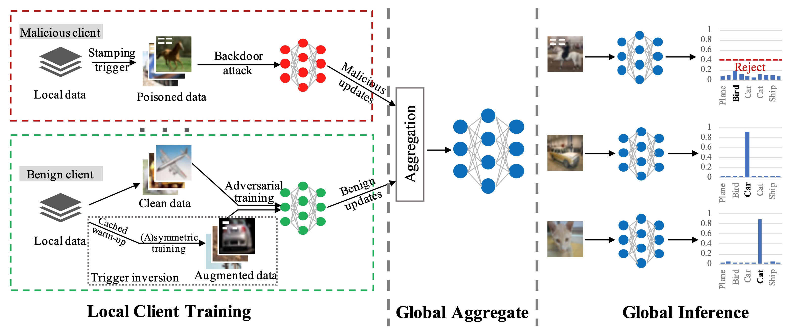

# FLIP: A Provable Defense Framework for Backdoor Mitigation in Federated Learning


Table of Contents
=================
- [Overview](#Overview)
- [Paper](https://arxiv.org/pdf/2210.12873.pdf)
- [Workshop Slides](https://kaiyuanzhang.com/slides/FLIP_slides.pdf)
- [Requirements](#Requirements)
- [Experiments](#Experiments)
    - [Install required packages](#Install_required_packages)
    - [MNIST](#MNIST)
    - [Fashion-MNIST](#Fashion-MNIST)
    - [CIFAR-10](#CIFAR-10)
- [Code Architecture](#Code_Architecture)
- [Citation](#Citation)
- [Acknowledgement](#Acknowledgement)

## Overview
- This is the PyTorch implementation for ICLR 2023 paper "[FLIP: A Provable Defense Framework for Backdoor Mitigation in Federated Learning](https://arxiv.org/abs/2210.12873)".  
- This paper also wins a [Best Paper Award](https://eccv22-arow.github.io/) :trophy: at ECCV 2022 AROW Workshop.  
- \[[openreview](https://openreview.net/pdf?id=Xo2E217_M4n)\] | \[[arXiv](https://arxiv.org/pdf/2210.12873.pdf)\] | \[[workshop slides](https://kaiyuanzhang.com/slides/FLIP_slides.pdf)\]



## Requirements
- Python >= 3.7.10
- PyTorch >= 1.7.1
- TorchVision >= 0.8.2
- PyYAML >= 6.0

## Experiments  
- Pre-trained clean models prepared in the directory `./saved_models/`.
- You can also train from round 0 to obtain the pre-trained clean models.
- Run the following commands to reproduce the results in the paper.

### Install required packages
```bash
# Create python environment (optional)
conda create -n flip python=3.7
source activate flip
```

Prior to federated training and inverting, make sure to create a data directory `./data/` and set the correct parameters in the `.yaml` file for `single-shot` or `continuous` FL backdoor attacks. Parameters can be found in the `./utils/xx.yaml` directory.

### MNIST
```bash
python main.py --params utils/mnist.yaml
```

### Fashion-MNIST
```bash
python main.py --params utils/fashion_mnist.yaml
```

### CIFAR-10
```bash
python main.py --params utils/cifar.yaml
```


## Code Architecture  
    .
    ├── data                            # data directory
    ├── models                          # model structures for different datasets
    ├── saved_models                    # pre-trained clean models and saved models during training
    │   ├── cifar_pretrain              # pre-trained clean models on CIFAR-10
    │   ├── fashion_mnist_pretrain      # pre-trained clean models on Fashion-MNIST
    │   └── mnist_pretrain              # pre-trained clean models on MNIST
    ├── utils                           # utils / params for different datasets
    ├── config.py                       # set GPU device and global variables
    ├── helper.py                       # helper functions
    ├── image_helper.py                 # helper functions for image datasets, e.g., load data, etc.
    ├── image_train.py                  # normal training and invert training
    ├── invert_CIFAR.py                 # benign local clients invert training on CIFAR-10
    ├── invert_FashionMNIST.py          # benign local clients invert training on Fashion-MNIST
    ├── invert_MNIST.py                 # benign local clients invert training on MNIST
    ├── main.py                         # main function, run this file to train and invert
    ├── test.py                         # test metrics
    ├── train.py                        # train function, image_train.py is called in this file
    └── ...


## Citation
Please cite our work as follows for any purpose of usage.

```bibtex
@inproceedings{
zhang2023flip,
title={{FLIP}: A Provable Defense Framework for Backdoor Mitigation in Federated Learning},
author={Kaiyuan Zhang and Guanhong Tao and Qiuling Xu and Siyuan Cheng and Shengwei An and Yingqi Liu and Shiwei Feng and Guangyu Shen and Pin-Yu Chen and Shiqing Ma and Xiangyu Zhang},
booktitle={The Eleventh International Conference on Learning Representations },
year={2023},
url={https://openreview.net/forum?id=Xo2E217_M4n}
}
```

## Acknowledgement
- [Backdoor Federated Learning](https://github.com/ebagdasa/backdoor_federated_learning)
- [DBA](https://github.com/AI-secure/DBA)
- [MOTH](https://github.com/Gwinhen/MOTH)
- [Neural Cleanse](https://github.com/bolunwang/backdoor)
- [PGD](https://github.com/MadryLab/cifar10_challenge)
